# Complete Agent System Visualization

**Comprehensive visual guide to the entire agent system architecture, workflows, and observability.**

---

## Table of Contents

1. [System Overview](#system-overview)
2. [Agent Onboarding Flow](#agent-onboarding-flow)
3. [Core Components](#core-components)
4. [Tool Ecosystem](#tool-ecosystem)
5. [Observability Stack](#observability-stack)
6. [Data Flow Architecture](#data-flow-architecture)
7. [Communication Patterns](#communication-patterns)
8. [Task Coordination Flow](#task-coordination-flow)
9. [Memory System Flow](#memory-system-flow)
10. [Agent Lifecycle](#agent-lifecycle)
11. [Complete Workflow Diagram](#complete-workflow-diagram)

---

## System Overview

The agent system is a comprehensive, self-improving ecosystem for managing home server infrastructure through AI agents. It provides structured workflows, observability, and coordination mechanisms.

**Architecture**: **Local-First** - All agent infrastructure runs locally on your machine.

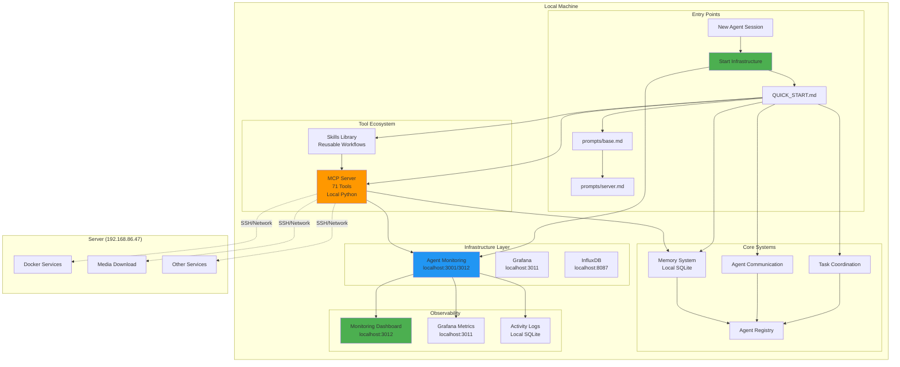

---

## Agent Onboarding Flow

### Step-by-Step Onboarding Process

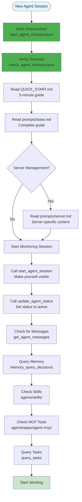

### Documentation Hierarchy

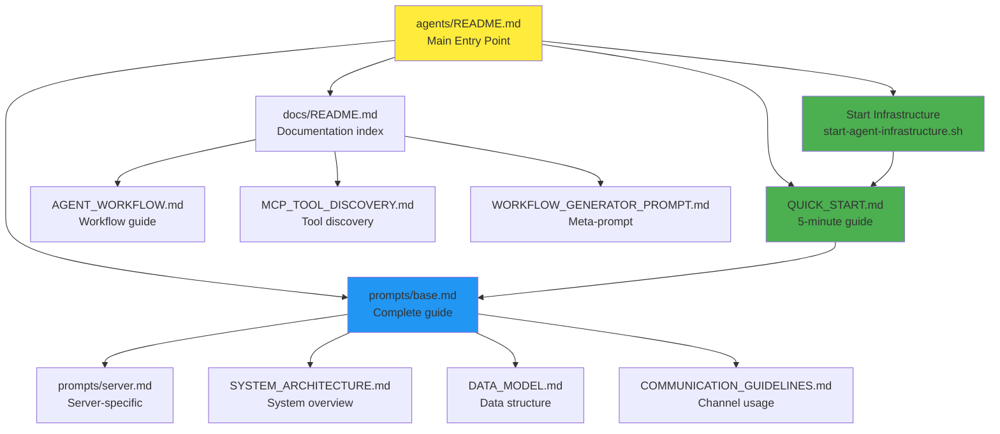

---

## Core Components

### Component Architecture

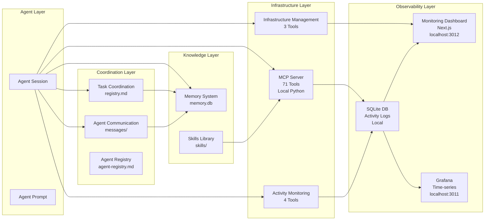

### Component Details

| Component | Location | Purpose | Key Files |
|-----------|----------|---------|-----------|
| **Agent Prompts** | `agents/docs/` | Agent instructions and context | `prompts/base.md`, `SERVER_prompts/base.md` |
| **Task Coordination** | `agents/tasks/` | Central task registry | `registry.md`, MCP tools |
| **Agent Communication** | `agents/communication/` | Inter-agent messaging | `messages/`, `protocol.md` |
| **Memory System** | `agents/memory/` | Persistent knowledge | `memory.db`, MCP tools |
| **Agent Registry** | `agents/registry/` | Agent definitions | `agent-registry.md`, `agent-definitions/` |
| **MCP Server** | `agents/apps/agent-mcp/` | Tool execution | `tools/`, `server.py` |
| **Skills Library** | `agents/skills/` | Reusable workflows | `skills/`, `README.md` |
| **Monitoring** | `agents/apps/agent-monitoring/` | Observability | Dashboard, Grafana, DB |

---

## Tool Ecosystem

### MCP Tools (71 Total)

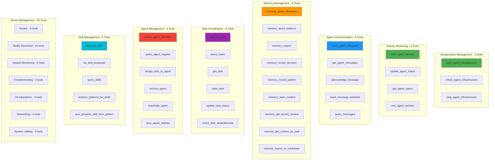

### Tool Discovery Priority

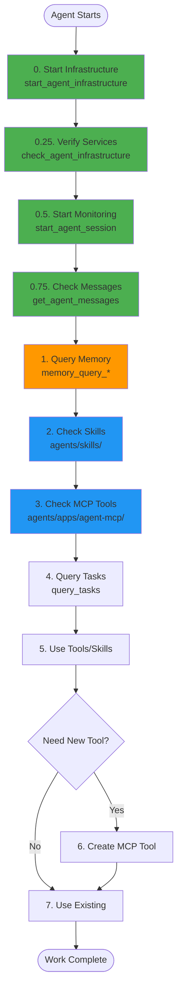

---

## Observability Stack

### Observability Architecture (Local-First)

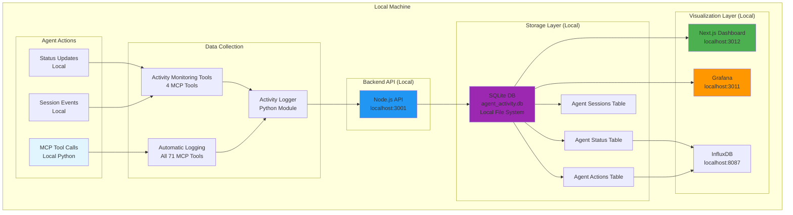

### Observability Flow

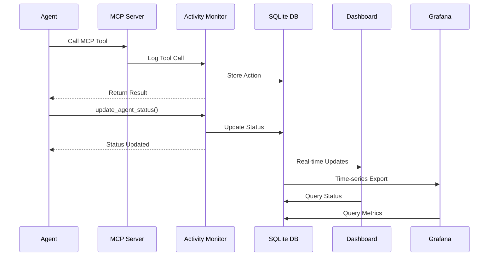

### What Gets Observed

| Action Type | Observable | Not Observable |
|-------------|------------|----------------|
| **MCP Tool Calls** | ✅ All automatically logged | ❌ |
| **Status Updates** | ✅ Via `update_agent_status()` | ❌ |
| **Session Events** | ✅ Start/end sessions | ❌ |
| **SSH Commands** | ❌ | ✅ Not logged |
| **Custom Scripts** | ❌ | ✅ Not logged |
| **Direct File Edits** | ❌ | ✅ Not logged |

**Key Principle**: Always use MCP tools for observability!

---

## Data Flow Architecture

### Complete Data Flow

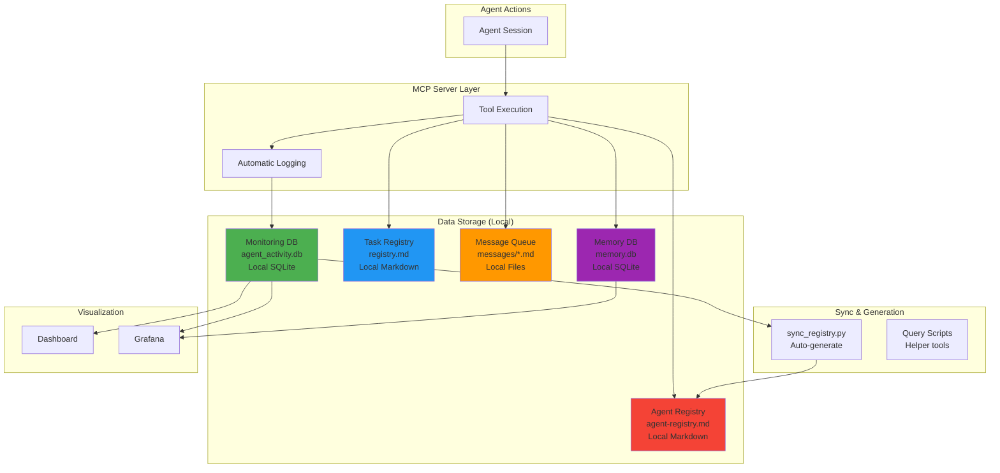

### Data Storage Strategy

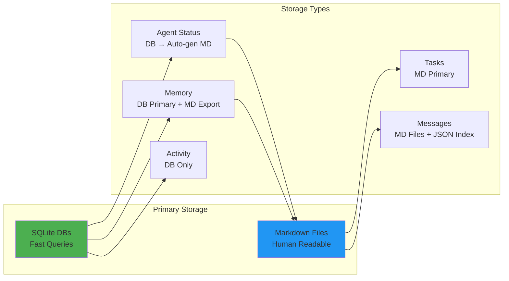

---

## Communication Patterns

### Inter-Agent Communication Flow

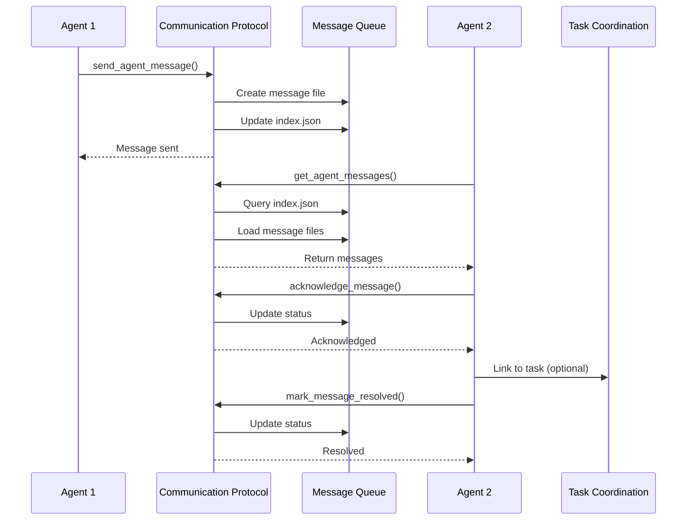

### Communication Channel Decision Tree

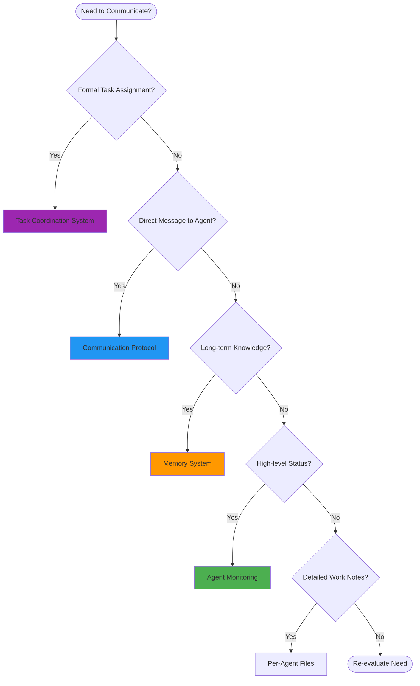

---

## Task Coordination Flow

### Complete Task Lifecycle

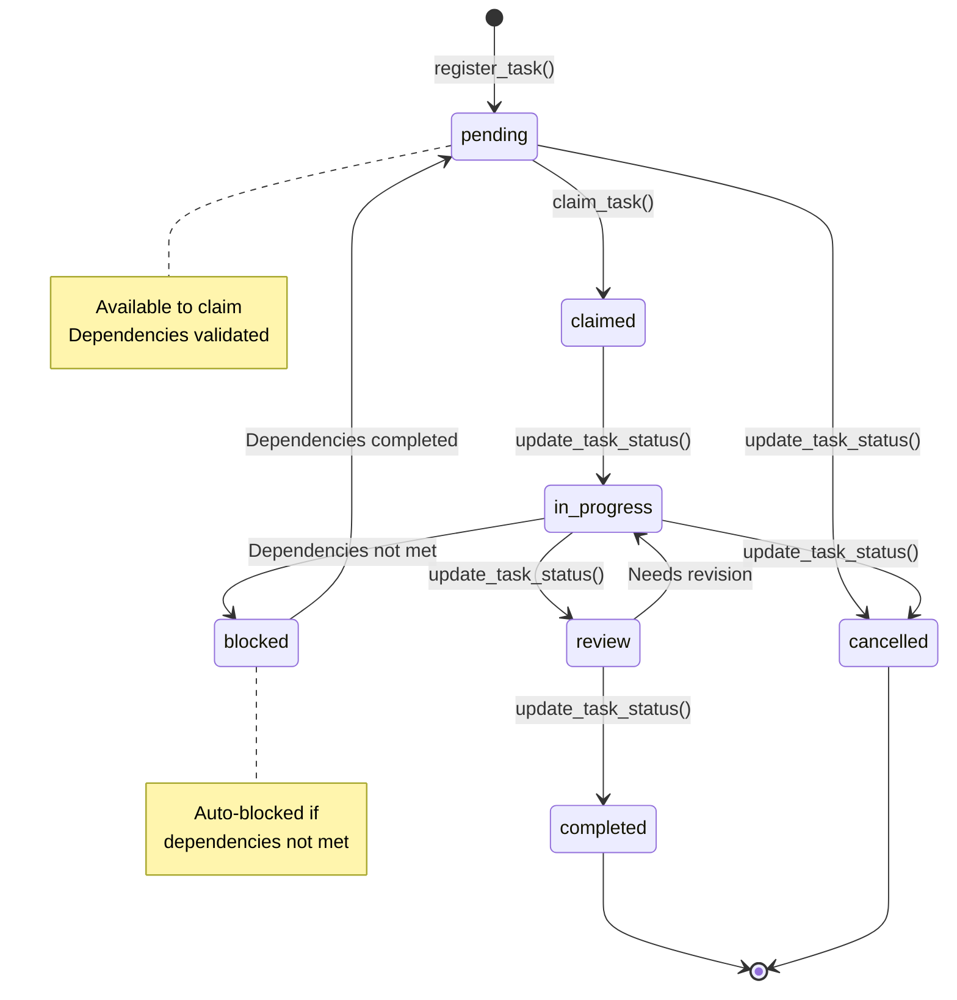

### Task Coordination Architecture

```mermaid
graph TB
    subgraph "Task Registration"
        A1[register_task<br/>Create new task]
        A2[Set dependencies]
        A3[Set priority]
    end
    
    subgraph "Task Discovery"
        B1[query_tasks<br/>Filter by status/assignee]
        B2[get_task<br/>Get single task]
        B3[check_task_dependencies<br/>Validate deps]
    end
    
    subgraph "Task Execution"
        C1[claim_task<br/>Assign to agent]
        C2[update_task_status<br/>Update progress]
        C3[Auto-update dependents]
    end
    
    subgraph "Storage"
        D1[registry.md<br/>Central registry]
        D2[Task ID Format<br/>T{project}.{task}]
    end
    
    A1 --> A2
    A2 --> A3
    A3 --> D1
    
    B1 --> D1
    B2 --> D1
    B3 --> D1
    
    C1 --> C2
    C2 --> C3
    C3 --> D1
    
    style D1 fill:#2196f3
```

---

## Memory System Flow

### Memory Operations

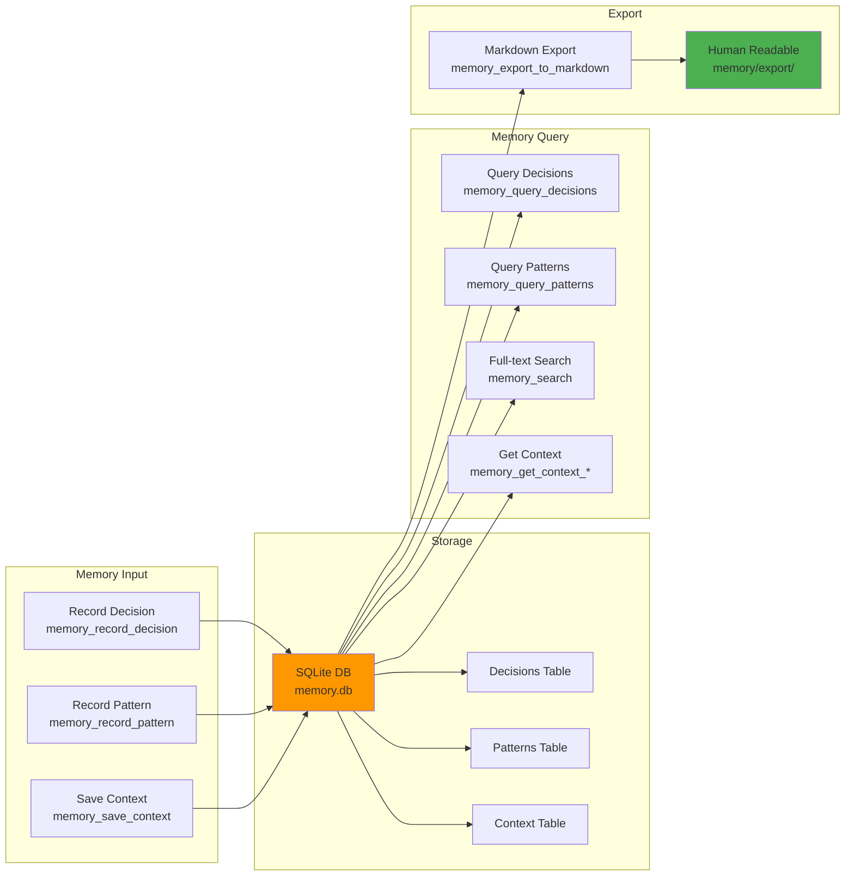

### Memory Integration

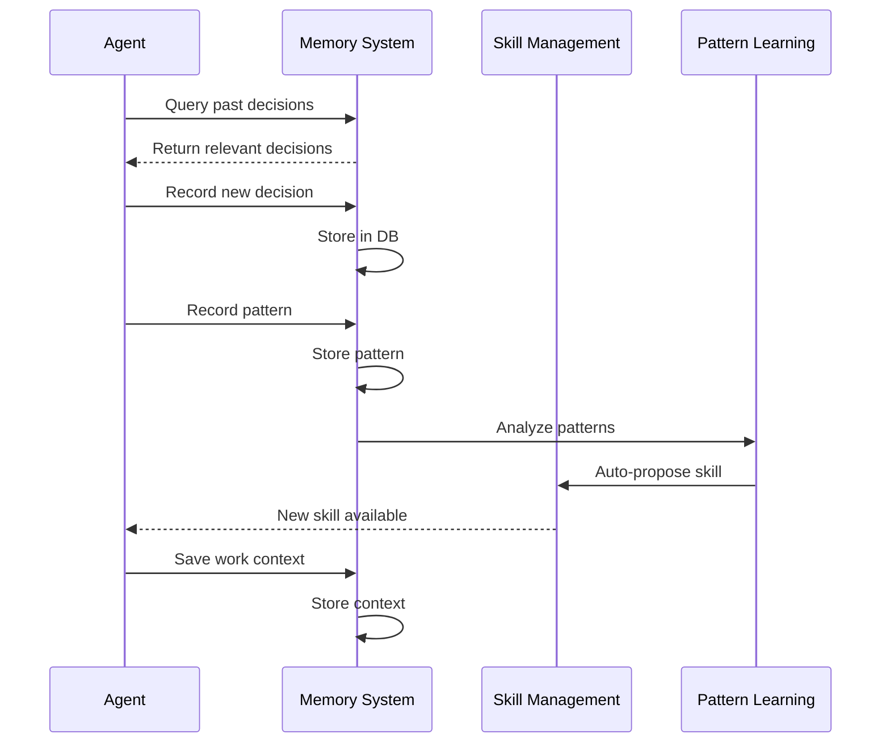

---

## Agent Lifecycle

### Lifecycle States

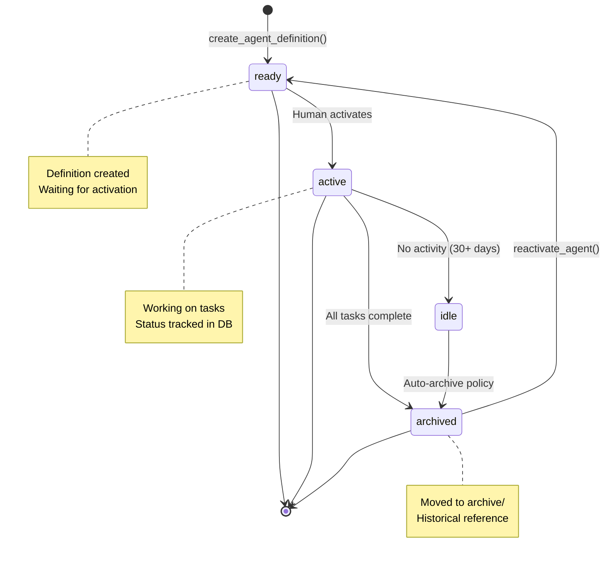

### Lifecycle Management Flow

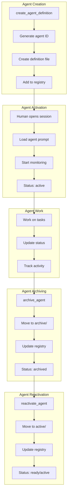

---

## Complete Workflow Diagram

### End-to-End Agent Workflow

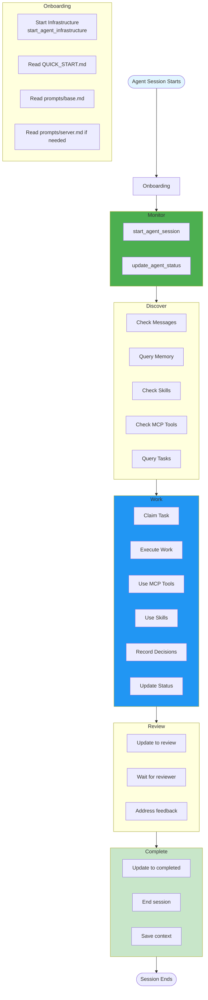

### System Integration Flow

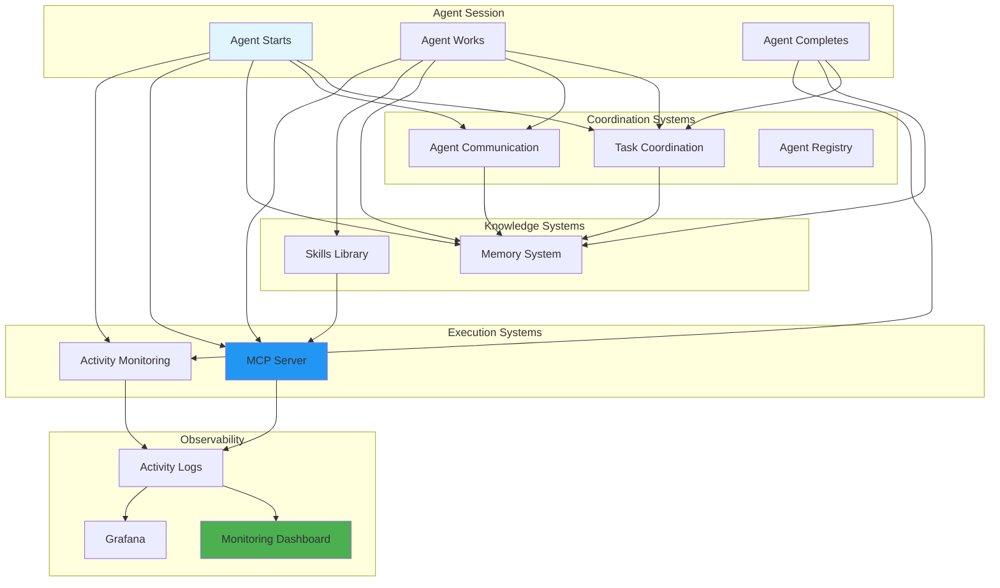

---

## Key Documentation Files

### Primary Entry Points

| File | Purpose | When to Use |
|------|---------|-------------|
| `agents/README.md` | Main entry point | First file to read |
| `agents/docs/QUICK_START.md` | 5-minute quick start | New agent onboarding |
| `agents/prompts/base.md` | Complete agent guide | Full agent context |
| `agents/prompts/server.md` | Server-specific guide | Server management agents |

### System Documentation

| File | Purpose | When to Use |
|------|---------|-------------|
| `agents/docs/SYSTEM_ARCHITECTURE.md` | System overview | Understanding architecture |
| `agents/docs/DATA_MODEL.md` | Data structure | Understanding storage |
| `agents/docs/COMMUNICATION_GUIDELINES.md` | Channel usage | Which channel to use |
| `agents/docs/AGENT_WORKFLOW.md` | Workflow guide | Understanding workflows |
| `agents/docs/MCP_TOOL_DISCOVERY.md` | Tool discovery | Finding tools |

### Reference Documentation

| File | Purpose | When to Use |
|------|---------|-------------|
| `agents/apps/agent-mcp/README.md` | MCP tools catalog | Finding tools |
| `agents/skills/README.md` | Skills catalog | Finding workflows |
| `agents/tasks/README.md` | Task coordination | Task management |
| `agents/communication/README.md` | Communication protocol | Inter-agent messaging |
| `agents/memory/README.md` | Memory system | Knowledge management |

---

## System Principles

### 1. Observability First
- **Always use MCP tools** - They're automatically logged
- **Start monitoring session** - Make yourself visible
- **Update status regularly** - Keep dashboard current
- **Avoid SSH/custom scripts** - They're not observable

### 2. Centralized Coordination
- **Task Coordination** - All tasks in central registry
- **Agent Communication** - Structured messaging protocol
- **Agent Registry** - Single source of truth
- **Memory System** - Shared knowledge base

### 3. Human-Readable Storage
- **Markdown First** - All data in human-readable format
- **Version Controlled** - All files in Git
- **Auto-Generated Views** - DB → Markdown sync
- **Queryable** - MCP tools and scripts for queries

### 4. Self-Improving System
- **Pattern Learning** - Auto-identify patterns
- **Skill Creation** - Convert patterns to skills
- **Memory Integration** - Learn from past decisions
- **Lifecycle Management** - Archive/reactivate agents

---

## Quick Reference

### Essential MCP Tools (Use First!)

```python
# 0. Start Infrastructure (DO THIS FIRST!)
await start_agent_infrastructure()
# Or: ./agents/scripts/start-agent-infrastructure.sh

# 1. Start Monitoring (DO THIS SECOND!)
start_agent_session(agent_id="your-agent-id")
update_agent_status(agent_id="your-agent-id", status="active", current_task_id="T1.1")

# 2. Check Messages
get_agent_messages(agent_id="your-agent-id", status="pending")

# 3. Query Memory
memory_query_decisions(project="home-server", search_text="deployment")
memory_query_patterns(severity="high")

# 4. Query Tasks
query_tasks(status="pending", priority="high")
claim_task(task_id="T1.1", agent_id="your-agent-id")

# 5. Update Task Status
update_task_status(task_id="T1.1", status="in_progress", agent_id="your-agent-id")

# 6. Record Decisions
memory_record_decision(content="Use PostgreSQL", rationale="ACID compliance")

# 7. End Session
end_agent_session(agent_id="your-agent-id", session_id="...", tasks_completed=1)
```

### Essential Documentation Path

```
1. agents/README.md (START HERE)
   ↓
2. agents/docs/QUICK_START.md (5 minutes)
   ↓
3. agents/prompts/base.md (Complete guide)
   ↓
4. agents/prompts/server.md (If server management)
   ↓
5. agents/docs/SYSTEM_ARCHITECTURE.md (System overview)
   ↓
6. Reference docs as needed
```

---

## System Metrics

### Current System State

- **Total MCP Tools**: 71 tools
- **Skills Available**: 7+ reusable workflows
- **Documentation Files**: 30+ markdown files
- **Active Systems**: 7 core systems
- **Storage Locations**: 5 primary storage systems (all local)
- **Observability**: 3 visualization layers (all localhost)
- **Architecture**: Local-first (all infrastructure runs locally)

### Tool Breakdown

- Infrastructure Management: 3 tools ⭐ NEW
- Activity Monitoring: 4 tools
- Agent Communication: 5 tools
- Memory Management: 9 tools
- Task Coordination: 6 tools
- Agent Management: 6 tools
- Skill Management: 5 tools
- Server Management: 33 tools

---

## Summary

This agent system provides:

✅ **Local-First Architecture** - All infrastructure runs locally (localhost)  
✅ **Structured Onboarding** - Clear entry points and documentation hierarchy  
✅ **Comprehensive Tooling** - 71 MCP tools for all operations  
✅ **Full Observability** - Dashboard (localhost:3012), Grafana (localhost:3011), and activity logs  
✅ **Centralized Coordination** - Task, communication, and registry systems  
✅ **Persistent Memory** - Learn from past decisions and patterns (local SQLite)  
✅ **Self-Improvement** - Pattern learning and auto-skill creation  
✅ **Lifecycle Management** - Archive/reactivate agents as needed  
✅ **Infrastructure Management** - Startup/stop tools for local infrastructure  

**All operations are observable, all data is human-readable, all systems are integrated, and everything runs locally.**

---

**Last Updated**: 2025-01-13  
**Status**: Active (Local-First Architecture)  
**Architecture**: All infrastructure runs locally on localhost  
**See Also**:
- `agents/README.md` - Main entry point and directory structure
- `agents/docs/SYSTEM_ARCHITECTURE.md` - Detailed architecture
- `agents/docs/DATA_MODEL.md` - Data structure details
- `agents/docs/COMMUNICATION_GUIDELINES.md` - Communication usage
- `agents/docs/QUICK_START.md` - Quick start guide
- `agents/scripts/start-agent-infrastructure.sh` - Infrastructure startup script

